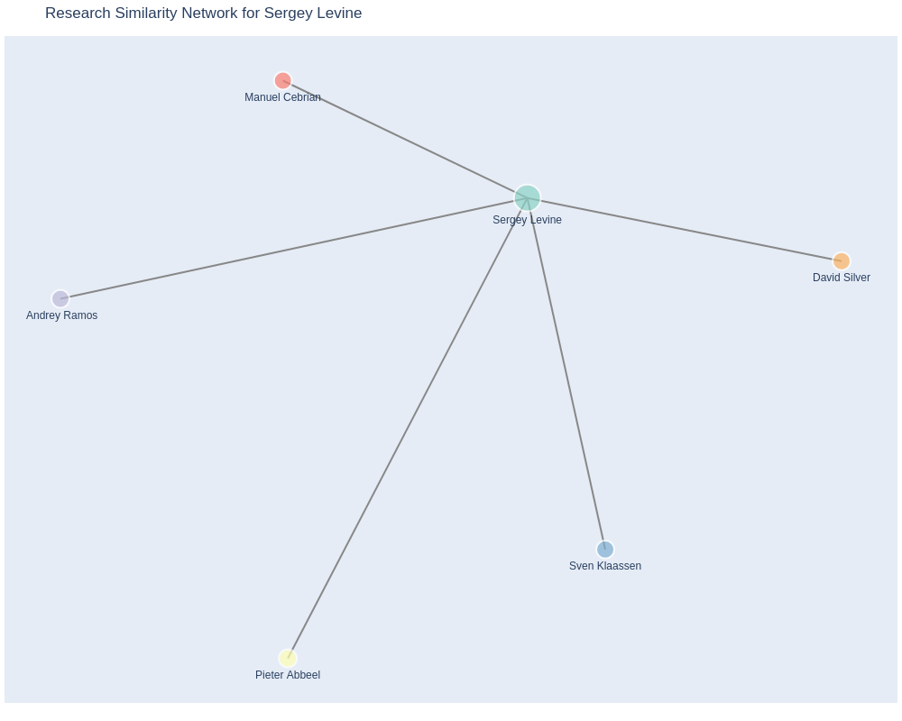

# 🎓 ProfessorConnected: An API for Discovering Similar Professors

## **📚 Overview**

ProfessorConnected is an API-driven system designed to identify professors with similar research interests based on their publications on [arXiv](https://arxiv.org/). The system crawls and processes professors' papers, extracts key information, and uses this data to find related academics.

## **🔍 How It Works**

The core of ProfessorConnected involves a multi-stage process:

1.  ### **🕸️ Crawling**
    The system begins by crawling papers associated with a given professor's name from arXiv.

2.  ### **📄 Paper Processing**
    Each paper undergoes detailed analysis, focusing on key sections:
    
    - **📝 Title Analysis:** The title is extracted and processed using the arXiv API.
    - **📖 Text Analysis:** The introduction and conclusion sections are summarized using a Large Language Model (LLM), specifically Mistral-Nemo 14B by default.
    - **🔑 Keyword Extraction:** Keywords are extracted using three methods:
        - **🧩 N-gram Based:** Identifies keywords based on the frequency of word sequences.
        - **🤖 BERT Based:** Uses a BERT model to extract contextual keywords.
        - **🧠 LLM Based:** Leverages an LLM to extract relevant keywords.
    - **🔄 LLM Revision:** All extracted keywords are refined and finalized using an LLM.

3.  ### **📈 Embedding**
    The processed title, summaries, and revised keywords from each paper are concatenated and embedded to create a vector representation.

4.  ### **🔗 Hybrid Search**
    When a user searches for a professor, the system performs a hybrid search:
    
    - **🔍 Retrieval:** Retrieves potentially related professors.
    - **📊 Ranking:** Ranks them based on the cosine similarity of their embeddings.
    - **🔄 Re-ranking:** Re-ranks them by adding a score based on the overlap of keywords between the query and the retrieved professor's papers.

## **🖼️ Diagram of Embedding Process**

```mermaid
graph LR
    A[Input: Professor Name] --> B[arXiv Crawler]
    B --> C[Paper Processing]
    
    subgraph "Paper Processing"
        C --> D[Title Analysis]
        C --> O[Figures Caption]
        C --> E[Text Analysis]
        C --> F[Keyword Extraction]
        
        subgraph "Keyword Methods"
            O --> F
            F --> G[N-gram]
            F --> H[BERT]
            F --> I[LLM]
            G & H & I --> J[LLM Revision]
        end
        
        E --> K[Summary Generation]
    end
    
    D & J & K --> L[Paper Embeddings]
    L --> M[Vector Database]
    M --> N[Hybrid Search & Ranking]
```

## **🚀 Getting Started**

Follow these steps to set up and run ProfessorConnected:

1.  ### **🧩 LLM Model Download**
    Download a GGUF format LLM model and place it in the `models` directory.

2.  ### **⚙️ Environment Setup**
    - **Create a virtual environment:**  
      ```bash
      python3 -m venv venv
      ```
    - **Install dependencies:**  
      ```bash
      make install
      ```
    - **Run the server:**  
      ```bash
      make run
      ```  
      This will start both the FastAPI server on port `8000` and the `llm-cpp-server` on port `5333`.
    - **💻 GPU Acceleration:**  
      To use GPU acceleration (half of the model layers on the GPU), run:  
      ```bash
      make run USE_GPU=true
      ```

3.  ### **🗃️ Populate the Database**
    - The vector database is initially empty.
    - Run `cold_start.py` or `make cold-start` to add initial professor data to the database.

4.  ### **🛠️ Using the API**
    - The `scripts` folder contains scripts for various operations:
        - **➕ Adding a professor**
        - **🧹 Cleaning the dataset**
        - **🔍 Finding similar professors and visualizing the results**
    - You can modify the `curl` request parameters to customize your search:
        - `limit`: The number of professors to retrieve.
        - `min_similarity`: The minimum cosine similarity threshold for retrieving results.
        - **⚠️ Note:** Increasing the number of professors in the database may require adjusting the `min_similarity` threshold for more accurate results.
    - **⚡ Quick Test:** Use `make image-request` to quickly test the API.

## **🖼️ Example Result**

The following image shows the result of a search for "Sergey Levine" after running the cold start mode:



## **🧪 Testing Strategy**

ProfessorConnected is rigorously tested using two methods:

- **🔧 Component Testing:**  
  Each individual component of the system (as shown in the diagram) is tested in isolation to ensure correct functionality.

- **🔄 End-to-End Testing:**  
  The entire system is tested by sending a request and verifying the final output.

- **✅ Test Execution:**  
  Run `make test` to execute all tests, covering both component and end-to-end testing.

## **📅 Project Timeline**

The project was developed over **15 days**:

- **🛠️ 3 days:** Architecture design and library selection.
- **🚀 7 days:** Deployment.
- **🧪 3 days:** Writing tests.
- **📄 2 days:** Documentation.

